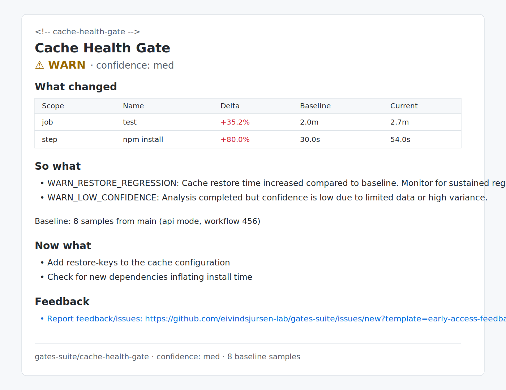

# Cache Health Gate (Public Beta)

GitHub Action that catches cache regressions in PRs before CI becomes quietly slower.

## What it catches

- cache key churn (for example accidental `${{ github.sha }}` in cache keys)
- cache hit-rate drops
- restore-time regressions

## Example output (actual format)

```md
<!-- cache-health-gate -->

## Cache Health Gate

**⚠️ WARN** · confidence: **med**

### What changed

| Scope | Name        |  Delta | Baseline | Current |
| ----- | ----------- | -----: | -------: | ------: |
| job   | test        | +35.2% |     2.0m |    2.7m |
| step  | npm install | +80.0% |    30.0s |   54.0s |

### So what

- **WARN_RESTORE_REGRESSION**: Cache restore time increased compared to baseline. Monitor for sustained regression.
- **WARN_LOW_CONFIDENCE**: Analysis completed but confidence is low due to limited data or high variance. Results may not be representative.

### Now what

- Add restore-keys to the cache configuration
- Check for new dependencies inflating install time
```

Screenshot:


## Install (primary path)

```yaml
- name: Cache Health Gate
  uses: eivindsjursen-lab/gates-suite-public-beta/packages/cache-health-gate@cache-health-gate/v1
  with:
    mode: warn
    no_baseline_behavior: warn
    baseline_event_filter: push
```

Quickstart (zero-assistance):

- https://github.com/eivindsjursen-lab/gates-suite-public-beta/blob/main/docs/launch/non-assisted-quickstart.md

Troubleshooting:

- https://github.com/eivindsjursen-lab/gates-suite-public-beta/blob/main/docs/troubleshooting/common-issues.md

If cross-repo action usage is blocked in your environment, use vendored/local fallback:

- https://github.com/eivindsjursen-lab/gates-suite-public-beta/blob/main/docs/launch/public-pilot-gist/README-pilot.md

## Caught in practice

### 1) Cache key churn killed reuse

Scenario:
A PR added `${{ github.sha }}` to a cache key.

Gate signal:
`WARN_HIT_RATE_DROP`

Why it matters:
Cache reuse drops across runs, causing slower installs/tests.

Fix:
Remove volatile values from cache key inputs and keep stable restore keys.

### 2) Restore time regressed after dependency growth

Scenario:
A lockfile change increased cache payload size.

Gate signal:
`WARN_RESTORE_REGRESSION`

Why it matters:
CI cost increases gradually without obvious failures.

Fix:
Review dependency/caching strategy and adjust restore threshold for noisy workflows if needed.

### 3) First run has no baseline (expected)

Scenario:
Fresh install on a repo with no default-branch baseline yet.

Gate signal:
`WARN_NO_BASELINE` (or `SKIP_NO_BASELINE` when configured)

Why it matters:
Not a regression; onboarding state.

Fix:
Run 5-10 successful `push` builds on the default branch.

### 4) Workflow has cache but no markers

Scenario:
Workflow uses cache but is missing `[cache-step]` and `[cache]` markers.

Gate signal:
`SKIP_NO_CACHE_DETECTED`

Why it matters:
Gate cannot associate cache step timing/hit data.

Fix:
Add one `[cache-step]` marker and one `[cache]` token step per cache group.

## Trust and safety

- no external SaaS backend
- no telemetry endpoint
- GitHub API only (`GITHUB_TOKEN`)
- minimal permissions (`contents: read`, `actions: read`; `pull-requests: write` only for PR comments)
- rollback in 1-2 minutes by removing workflow/job/step

Details:

- Security policy: https://github.com/eivindsjursen-lab/gates-suite-public-beta/blob/main/SECURITY.md
- Permissions: https://github.com/eivindsjursen-lab/gates-suite-public-beta/blob/main/docs/launch/public-pilot-gist/PERMISSIONS.md
- Rollback: https://github.com/eivindsjursen-lab/gates-suite-public-beta/blob/main/docs/launch/public-pilot-gist/ROLLBACK.md

## Feedback

Report feedback/issues:

- https://github.com/eivindsjursen-lab/gates-suite-public-beta/issues/new?template=early-access-feedback.yml

Please include:

- workflow type (single job/matrix)
- package stack (npm/pnpm/yarn/pip/uv)
- whether warning was correct/noisy
- whether you would keep it enabled

## Other gates in this monorepo

- CI Minutes Delta Gate: planned/internal
- Agent Permission Diff Gate: planned/internal

For contributors/maintainers:

- https://github.com/eivindsjursen-lab/gates-suite-public-beta/blob/main/CONTRIBUTING.md
- https://github.com/eivindsjursen-lab/gates-suite-public-beta/blob/main/DEVELOPMENT.md
